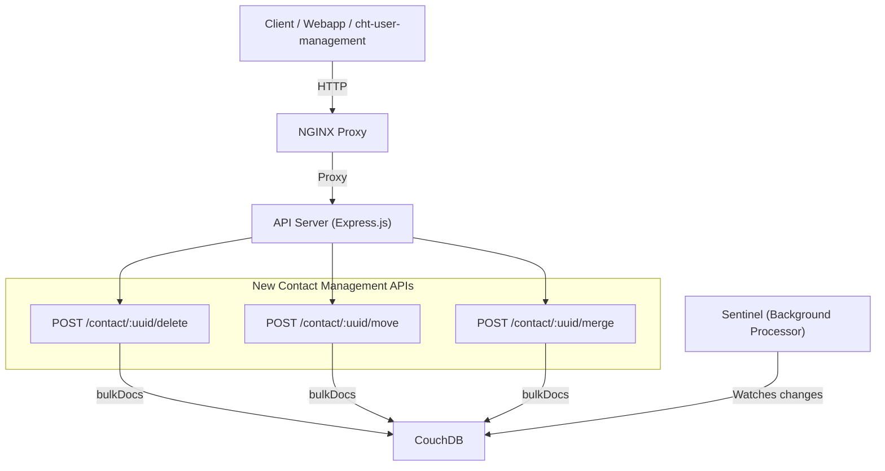
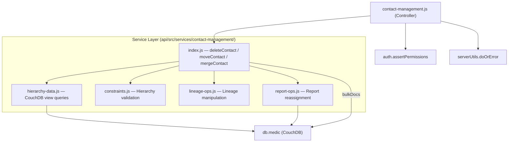
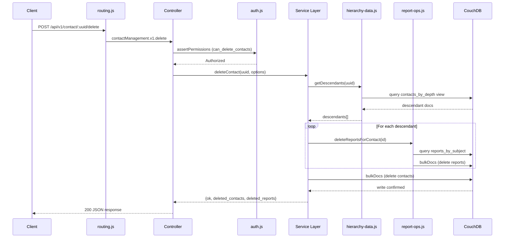
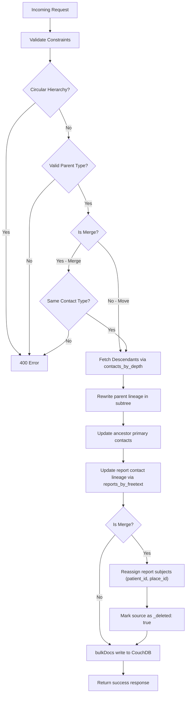

# Architecture & Framework Diagrams

## 1. System Architecture - Where New APIs Fit

## 2. Service Layer Module Architecture

## 3. Request Flow - Delete Contact Operation

## 4. Data Flow - Move vs Merge Operations

